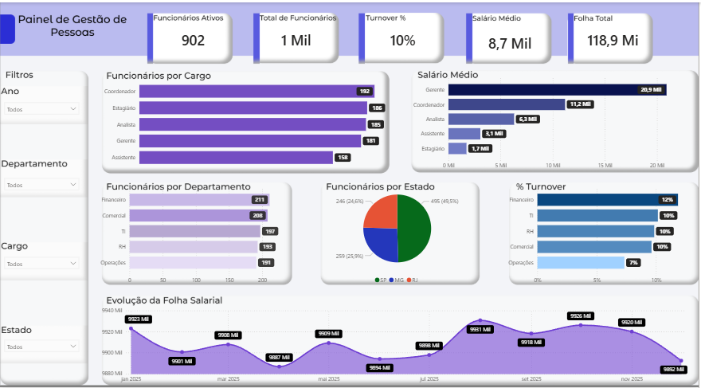
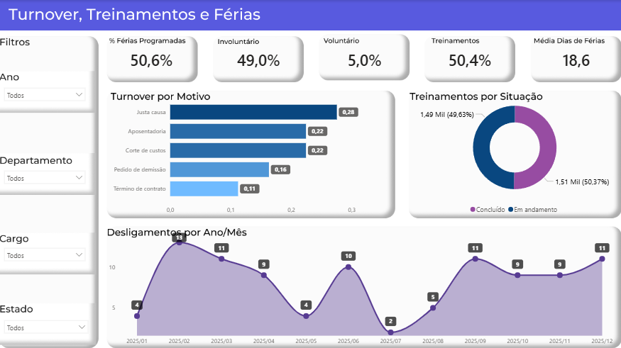

Painel de Análise de Pessoas — Power BI

Painel de gestão de pessoas construído em Power BI, simulando um cenário real de RH: acompanhamento de headcount, folha salarial, turnover, treinamentos e férias.

> **Dados fictícios**, gerados exclusivamente para fins de portfólio. Nenhuma informação real de empresa ou colaborador foi utilizada.

---

## Objetivo

Transformar uma base bruta de RH em um painel que responde perguntas reais de negócio: quantos funcionários estão ativos, qual o turnover por área e por motivo, como a folha evolui ao longo do tempo, e como estão treinamentos e férias do time.

Mais do que construir gráficos, o foco do projeto foi **modelar os dados corretamente** e escrever as medidas DAX certas para que cada número tivesse significado analítico — não só visual.

---

## Preview

### Capa


### Visão Geral — Headcount e Folha


### Turnover, Treinamentos e Férias


---

## Modelo de dados

O projeto usa um modelo relacional com 5 tabelas conectadas:

| Tabela | Descrição |
|---|---|
| `Funcionarios` | Dados cadastrais: cargo, departamento, estado, salário, admissão |
| `Folha` | Histórico de folha salarial mensal |
| `Treinamentos` | Registro de treinamentos por funcionário e situação |
| `Ferias` | Períodos de férias, dias e status |
| `Desligamentos` | Desligamentos, motivo e tipo (voluntário/involuntário) |
| `Calendario` | Tabela de datas para análises temporais |

## 📐 Principais medidas DAX

- `Turnover %`, `Turnover Involuntario %`, `Turnover Voluntario %`
- `Turnover por Motivo %`
- `Taxa Conclusao Treinamentos %`
- `Media Dias Ferias`
- `% Ferias Programadas`
- `Crescimento da Folha Salarial %`
- `Tempo Medio de Empresa (anos)`

## Principais insights

- Turnover geral de **10%**, com predominância de desligamentos **involuntários (49%)**
- **Justa causa** e **corte de custos** são os principais motivos de desligamento
- **50,4%** dos treinamentos já concluídos
- Funcionários tiram em média **18,6 dias** de férias por período

---

## Ferramentas utilizadas

- Power BI Desktop
- DAX (medidas calculadas)
- Excel (tratamento inicial da base)

## Estrutura do repositório

```
painel-de-analise-de-pessoas/
├── README.md
├── People_Analytics.pbix
├── documentos/
│   ├── Capa.png
│   ├── Painel de controle.png
│   └── Turnover.png
└── dados/
    └── Base_PowerBI_People_Analytics.xlsx
```

## Como usar

1. Baixe o arquivo `People_Analytics.pbix`
2. Abra no Power BI Desktop
3. Navegue pelas páginas: Capa → Dashboard → Turnover, Treinamentos e Férias

---

## Contato

Feedbacks e sugestões são bem-vindos! Fique à vontade para abrir uma *issue* ou me chamar no [LinkedIn](https://www.linkedin.com/in/alexsandro-nogueira-33b4b9108).
